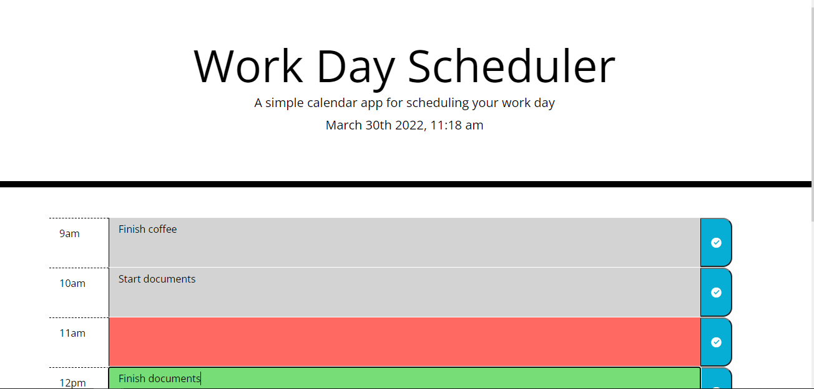

# Work Day Scheduler 

## Busy day at work? Organize and schedule it all with this work day scheduler web application!    

### Developed as a challenge for the Rutgers Coding Bootcamp, this web app makes use of JQuery functions    

[Link to application](https://kgil60.github.io/workday-scheduler/)    

### Color coded based on what time of day it is    

 
Preview of scheduler home screen    

### Save your events into localStorage with the big blue "save" button next to each time block. Never lose another appointment!
   

Built with HTML, CSS, and JavaScript